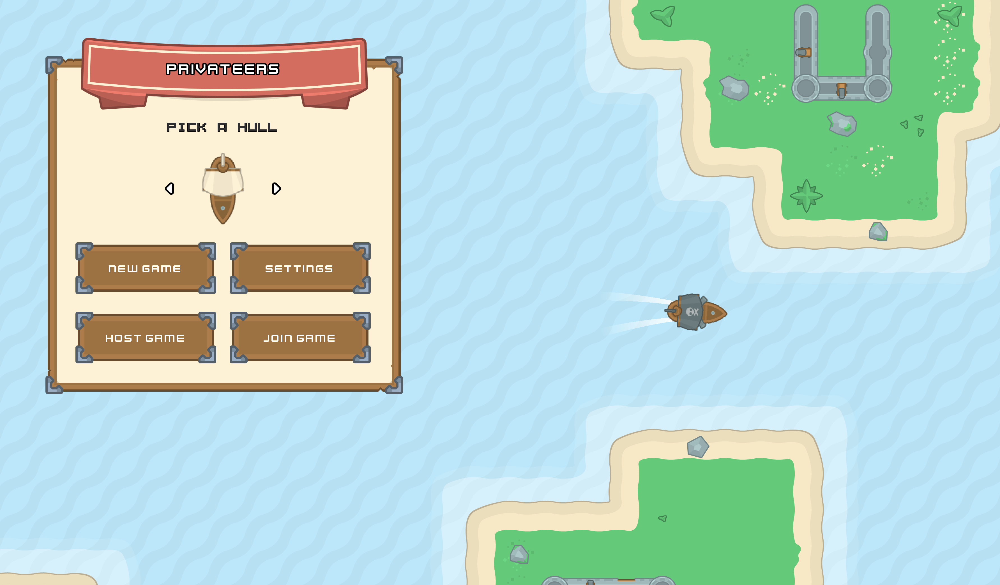

# Privateers

An exploratory game to learn the Godot engine and its many systems and controls. This is a 
small ship battle game with a conquest game mode.

## Resources

This was built using mostly [Kenney](https://kenney.nl) assets, including:
	
* [Pirate Pack](https://kenney.nl/assets/pirate-pack)
* [UI Pack - Adventure](https://kenney.nl/assets/ui-pack-adventure)
* [Cursor Pack](https://kenney.nl/assets/cursor-pack)
* [Input Prompts](https://kenney.nl/assets/input-prompts)
* [Fonts](https://kenney.nl/assets/kenney-fonts)
* _and more!_

## Screenshots & Video

